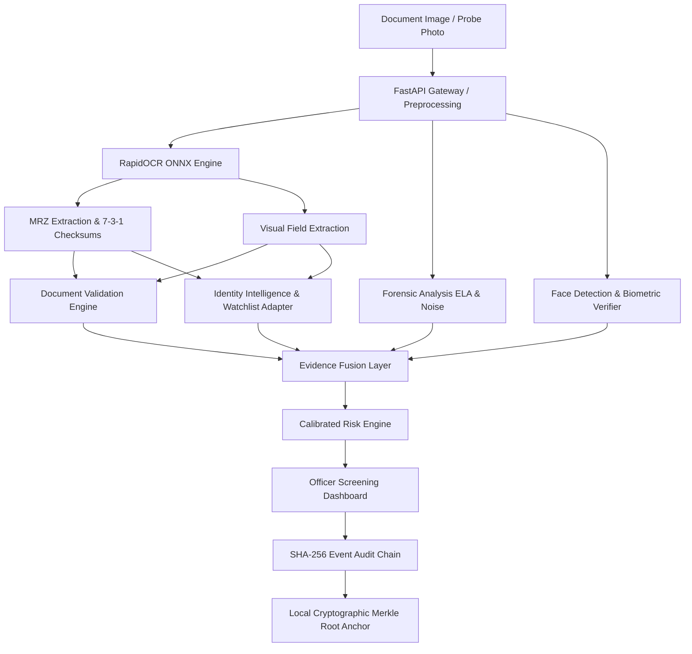

# TruthLens AI 3.0

### AI-Based Fake Identity & Document Screening System
**Smart India Hackathon (SIH 2026) · Problem Statement: PS 26188**  
*National Border Security & Identity Verification Prototype*

---

## Important Prototype Disclaimers

> [!IMPORTANT]
> **Operational Scope & Legal Notice**:
> - **Decision Support Only**: TruthLens AI 3.0 is an assistive screening tool designed for border control checkpoint officers. It is **not** an autonomous legal decision-maker.
> - **Synthetic Registry Data**: Government database lookups (Passport Seva, Watchlist, Visa Registry) in this prototype utilize **controlled synthetic demonstration data**. This project does **not** claim live operational integration with confidential Ministry of Home Affairs, Sashastra Seema Bal (SSB), or national immigration databases.
> - **Cryptographic Integrity Anchor**: The blockchain integrity mechanism is implemented as a **local cryptographic SHA-256 Merkle-tree anchoring layer**. It does not require a public blockchain network, external gas fees, or third-party cryptocurrency wallets.
> - **Fraud Detection Scope**: Statistical and forensic algorithms reduce officer inspection time and highlight anomalies; no computer vision system achieves 100% autonomous detection across unseen adversarial manipulations.

---

## 1. Project Overview

At border checkpoints, immigration desks, and identity screening gates, officers face increasingly sophisticated forged identity documents, AI-generated facial portraits, tampered MRZ check digits, and fraudulent credentials. 

**TruthLens AI 3.0** addresses **PS 26188** by providing an end-to-end identity screening portal. It combines local optical character recognition (OCR), machine-readable zone (MRZ) mathematical validation, deep image forensics (Error Level Analysis, PRNU sensor noise), biometric facial verification, cross-case identity consistency checks, multi-source evidence fusion, explainable risk scoring, and a tamper-evident audit trail anchored by cryptographic hashes.

---

## 2. SIH 2026 / PS 26188 Context

- **Event**: Smart India Hackathon 2026
- **Problem Statement ID**: PS 26188
- **Category**: Software / National Security
- **Target Organization**: Sashastra Seema Bal (SSB) / Ministry of Home Affairs (MHA)
- **Primary Objective**: Automated screening and early anomaly detection in travel documents, passports, and identity credentials presented at border crossings.

---

## 3. Key Capabilities

1. **Local Optical Character Recognition (OCR)**:
   - Powered by an offline, CPU/GPU-compatible ONNX Runtime engine (RapidOCR) with Tesseract fallback.
   - Extracts visual zone text: Passport Number, Full Name, DOB, Expiry, Nationality, and Sex.
2. **ICAO Doc 9303 Compliant MRZ Engine**:
   - Parses 2-line (TD3 / Passport) and 3-line (TD1 / ID card) Machine Readable Zones.
   - Validates all 5 mandatory check digits (Document Number, Birth Date, Expiry Date, Optional Data, Composite Checksum) using official 7-3-1 weight algorithms.
3. **Deterministic Document Validation**:
   - Cross-verifies visual zone fields against parsed MRZ records.
   - Flags date inconsistencies, underage/overage anomalies, and expired credentials without probabilistic hallucinations.
4. **Multi-Track Image Forensics**:
   - **Error Level Analysis (ELA)**: Detects compression rate variations caused by digital copy-paste or spliced seals.
   - **PRNU Sensor Noise Analysis**: Evaluates high-frequency wavelet residuals for sensor homogeneity.
   - **EXIF Metadata Integrity**: Audits digital software tags, camera fingerprints, and timestamp discrepancies.
5. **Biometric Face Verification**:
   - Local Haar-cascade face extraction with DeepFace cosine-similarity embedding comparison against live probe photos.
6. **Identity Intelligence & Watchlist Screening**:
   - Detects duplicate identity attempts across historical screenings (same name/DOB under different passport numbers).
   - Simulates border watchlist matching with fuzzy transliteration handling.
7. **Evidence Fusion & Calibrated Risk Engine**:
   - Aggregates evidence weights into an explainable 0–100 risk score and three calibrated tiers: `CLEAR`, `MANUAL_REVIEW`, or `HIGH_RISK`.
8. **Tamper-Evident SHA-256 Audit Trail & Merkle Anchor**:
   - Chronologically chains every pipeline event with cryptographic hashes.
   - Produces periodic Merkle root integrity anchors for independent validation.

---

## 4. System Architecture



---

## 5. Technology Stack

- **Backend Framework**: Python 3.11 · FastAPI · Uvicorn
- **Computer Vision & OCR**: RapidOCR (ONNX Runtime) · OpenCV · Pillow (PIL) · SciPy · NumPy
- **Biometrics & Forensics**: DeepFace · Haar Cascade · Wavelet PRNU Analysis · ELA
- **Frontend Architecture**: React 19 · TypeScript · Vite · Lucide Icons · Vanilla CSS Design System
- **Database & Auditing**: SQLite3 (thread-safe connection pooling) · Cryptographic SHA-256 chaining · Merkle Trees
- **Packaging & Deployment**: Docker (multi-stage) · Render Blueprint (`render.yaml`)

---

## 6. Core Screening Workflow

```
Uploaded Document
       │
       ▼
[Stage 1: Document Classification & Validation]
  ├── Verify file format and magic byte signature
  └── Check image dimensions and character legibility
       │
       ▼
[Stage 2: Local OCR Text & Field Extraction]
  ├── Visual zone text extraction via RapidOCR
  └── Extraction of Surname, Given Names, DOB, Expiry, Document Number
       │
       ▼
[Stage 3: MRZ Parsing & Checksum Computation]
  ├── Regex pattern match on Line 1 & Line 2
  └── Mathematical validation of check digits (weights: 7, 3, 1)
       │
       ▼
[Stage 4: Cross-Zone Field Verification]
  └── Compare visual zone values directly against decoded MRZ data
       │
       ▼
[Stage 5: Image Forensics & Biometric Inspection]
  ├── Error Level Analysis (ELA) heatmap generation
  ├── PRNU wavelet noise consistency check
  └── 1:1 facial biometric cosine similarity vs live probe image
       │
       ▼
[Stage 6: Identity Intelligence & Registry Cross-Check]
  ├── Check for duplicate identities across previous screenings
  └── Check simulated SSB border watchlist
       │
       ▼
[Stage 7: Evidence Fusion & Risk Classification]
  ├── Weighted scoring of all positive & negative signals
  └── Verdict assignment: CLEAR · MANUAL_REVIEW · HIGH_RISK
       │
       ▼
[Stage 8: SHA-256 Audit Trail & Cryptographic Anchoring]
  └── Cryptographically link event hashes into audit log & Merkle root
```

---

## 7. Security & Audit Integrity

- **Immutable Hash Chaining**: Every stage transition (`SCREENING_STARTED`, `OCR_COMPLETE`, `MRZ_CHECKED`, `VALIDATION_RUN`, `FACE_VERIFIED`, `RISK_ASSESSED`, `COMPLETED`) produces a SHA-256 hash incorporating the previous block's hash, timestamp, actor ID, and payload digest.
- **Independent Chain Verification**: The portal provides a one-click chain integrity verifier that recomputes all historical hashes from genesis to verify zero tampering.
- **OWASP Defensive Headers**: FastAPI injects `X-Content-Type-Options: nosniff`, `X-Frame-Options: DENY`, `X-XSS-Protection: 1; mode=block`, and strict Referrer Policies.

---

## 8. Blockchain Integrity Anchor

Rather than relying on volatile public cryptocurrency networks or incurring transaction latency, TruthLens implements a **local cryptographic blockchain integrity layer**:
- Audit events are grouped into verifiable blocks.
- A Merkle tree root is generated across block transaction hashes.
- Officers can export or verify the anchored Merkle proof to prove that screening records existed in an unmodified state at a given timestamp.

---

## 9. Pre-configured Demo Cases

To test the system immediately without external files, 8 synthetic test profiles are built into the pipeline:

| Case ID | Title | Synthetic Anomaly Simulated | Expected Risk |
| :--- | :--- | :--- | :--- |
| `01_CLEAN_PASSPORT` | Clean Passport | All checks pass; healthy baseline document | `CLEAR` |
| `02_TAMPERED_DOB` | Tampered DOB | Visual zone date differs from MRZ date | `HIGH_RISK` |
| `03_MRZ_MISMATCH` | MRZ Check Digit Failure | Deliberate checksum error in MRZ line 2 | `HIGH_RISK` |
| `04_FACE_MISMATCH` | Face Mismatch | Live probe photo does not match document photo | `MANUAL_REVIEW` |
| `05_EXPIRED_DOCUMENT` | Expired Document | Document validity date is in the past | `HIGH_RISK` |
| `06_VISA_INCONSISTENCY` | Visa Inconsistency | Passport unlisted in visa authorization database | `MANUAL_REVIEW` |
| `07_POTENTIAL_DUPLICATE_IDENTITY` | Duplicate Identity | Identity matched under an alternate document number | `MANUAL_REVIEW` |
| `08_MULTI_ANOMALY` | Multi-Anomaly Case | Tampered DOB + MRZ error + ELA anomaly | `HIGH_RISK` |

---

## 10. Local Setup & Quick Start

### Prerequisites
- Python 3.11+
- Node.js 18+ and npm
- Git

### Installation Steps

```bash
# 1. Clone repository
git clone https://github.com/<your-username>/TruthLens-AI.git
cd TruthLens-AI

# 2. Create Python virtual environment
python -m venv .venv

# Activate on Windows:
.\.venv\Scripts\activate
# Activate on Linux / macOS:
source .venv/bin/activate

# 3. Install backend dependencies
pip install -r requirements.txt

# 4. Install frontend dependencies
cd frontend
npm install
cd ..

# 5. Launch both services with unified runner
python start.py
```

- **Web Portal**: [http://localhost:5173](http://localhost:5173)
- **FastAPI Documentation**: [http://localhost:8000/docs](http://localhost:8000/docs)
- **Health Check**: [http://localhost:8000/health](http://localhost:8000/health)

---

## 11. Environment Variables

Create `.env` in project root (or reference [`.env.example`](./.env.example)):

| Variable | Required? | Default | Description |
| :--- | :---: | :--- | :--- |
| `APP_ENV` | Optional | `development` | Set to `production` in deployed environments. |
| `PORT` | Optional | `8000` | Port for FastAPI server (Render sets automatically). |
| `CORS_ORIGINS` | In Prod | *(empty)* | Comma-separated allowed origins (e.g. frontend URL). |
| `DATABASE_PATH` | Optional | `truthlens.db` | Path to SQLite database file. |
| `GEMINI_API_KEY` | Optional | *(empty)* | Google Gemini API key for multimodal reasoning. |
| `GEMINI_MODEL` | Optional | `gemini-2.0-flash` | Gemini model variant. |

Frontend configuration ([`frontend/.env.example`](./frontend/.env.example)):

| Variable | Required? | Default | Description |
| :--- | :---: | :--- | :--- |
| `VITE_API_BASE_URL` | In Prod | *(empty)* | Deployed backend URL (e.g. `https://truthlens-backend.onrender.com`). |

---

## 12. API & Health Check

### Health Check Endpoint
```http
GET /health
```
**Response (HTTP 200)**:
```json
{
  "status": "ok",
  "service": "TruthLens Border Intelligence",
  "version": "2.0.0",
  "prototype": true,
  "notice": "SIH 2026 PROTOTYPE — NOT FOR OPERATIONAL USE"
}
```

### Main API Routes
- `POST /api/v1/screening/passport`: Run full screening pipeline on uploaded document and optional probe photo.
- `GET /api/v1/screening/demo/cases`: List available synthetic test profiles.
- `POST /api/v1/screening/demo/run/{case_id}`: Execute screening on a selected test profile.
- `GET /api/v1/screening/history`: Retrieve recent screening records and risk summaries.
- `GET /api/v1/audit/chain`: Retrieve and verify the cryptographic SHA-256 audit log.

---

## 13. Render Cloud Deployment

The repository is configured for Render deployment via [`render.yaml`](./render.yaml).

For full deployment details and URL configuration, refer to [`DEPLOYMENT.md`](./DEPLOYMENT.md).

### Summary Deployment Flow:
1. Connect repository in Render under **Blueprints**.
2. Deploy backend service (`truthlens-backend`).
3. Set `VITE_API_BASE_URL` on frontend (`truthlens-frontend`) to the backend's Render URL and trigger deploy.
4. Set `CORS_ORIGINS` on the backend to the frontend's Render URL.

---

## 14. Project Structure

```
Truthlens-AI-main/
├── api/                     # FastAPI route handlers, schemas, and entry point (main.py)
├── database/                # SQLite initialization and database query adapters (db.py)
├── forensics/               # Image forensics (ELA, noise analysis, document forensics)
├── frontend/                # React 19 + TypeScript + Vite frontend application
│   ├── public/              # Static assets (including team photos and social icons)
│   ├── src/                 # React components, pages, context, and styles
│   ├── package.json         # Frontend dependencies and build scripts
│   └── vite.config.ts       # Vite configuration and development proxy
├── passport/                # PS 26188 core screening modules
│   ├── ocr_engine.py        # RapidOCR / Tesseract local OCR engine
│   ├── mrz_engine.py        # ICAO 9303 MRZ parser and 7-3-1 check digit validation
│   ├── document_validator.py# Deterministic cross-zone field validation
│   ├── face_verifier.py     # Biometric face detection & embedding comparison
│   ├── identity_intelligence.py # Cross-case identity consistency & anomaly checks
│   ├── registry_adapter.py  # Simulated passport, visa, and watchlist registry lookups
│   ├── evidence_fusion.py   # Multi-track evidence combination
│   ├── risk_engine.py       # Calibrated risk calculation and tier assignment
│   ├── audit_trail.py       # SHA-256 event chaining & Merkle integrity anchors
│   └── demo_cases.py        # Synthetic test case generator
├── utils/                   # Shared helpers, configuration loader, and cryptographic utilities
├── .env.example             # Backend environment template
├── DEPLOYMENT.md            # Render and local deployment instructions
├── Dockerfile               # Multi-stage production container build
├── render.yaml              # Render Blueprint definition (Web service + Static site)
├── requirements.txt         # Python dependencies
└── start.py                 # Unified local launcher
```

---

## 15. Limitations

- **Render Ephemeral Filesystem**: On free-tier Render instances, SQLite data resets on restarts or redeployments. Production setups require persistent disk mounts or external database hosting.
- **Physical Document Features**: Ultraviolet (UV) fluorescence, holographic OVD verification, and RFID chip cryptography require specialized optical and NFC hardware scanners not simulated via standard image uploads.
- **Camera Distortion**: Heavily skewed or unaligned smartphone captures may require manual orientation correction before OCR extraction.

---

## 16. Current vs Future Capabilities

| Capability Area | Current Implementation (Prototype) | Future Operational Roadmap |
| :--- | :--- | :--- |
| **OCR** | Local RapidOCR (ONNX) + Tesseract fallback | Multi-spectral infrared/UV OCR scanning |
| **MRZ** | Full ICAO 9303 TD1/TD3 check-digit validation | Optical variable ink & microprint validation |
| **Biometrics** | 1:1 Cosine facial embedding similarity | 1:N biometric gallery search & 3D liveness detection |
| **Databases** | Synthetic demonstration registry lookups | Direct encrypted API integration with Passport Seva / CCTNS |
| **Integrity** | Local SHA-256 chaining & Merkle root export | Anchoring to national hyperledger / permissioned consortia |

---

## 17. Resource Links

- **User Manual**: [Google Drive Documentation](https://drive.google.com/drive/u/1/folders/1KlQV2Hw7J_aOUNUP3-LuD3eCjXTg0HL2)
- **Research Documentation**: [Google Drive Research Archive](https://drive.google.com/drive/u/1/folders/104ipO95zwUj5B5Qqa48hEoOhATOhp_uV)
- **Live Portal Demo**: `[Render URL]` *(Configure upon deployment)*
- **API Backend Endpoint**: `[Render backend URL]` *(Configure upon deployment)*
- **Demonstration Video**: `[YouTube URL]` *(Pending publication)*

---

## 18. User Manual

For an in-depth, step-by-step walkthrough of border officer inspection workflows, audit chain export, and screening interpretation, consult the [User Manual Google Drive Folder](https://drive.google.com/drive/u/1/folders/1KlQV2Hw7J_aOUNUP3-LuD3eCjXTg0HL2).

---

## 19. Team HackManthan

Built with dedication by **Team HackManthan** for **Smart India Hackathon 2026**:

1. **Sujal Kumar Patwa** — *Team Lead · Full-Stack & AI Integration*  
   [LinkedIn](https://www.linkedin.com/in/sujal-kumar-ddu/) · [GitHub](https://github.com/Sujal-CSE25)
2. **Aayush Mani Tripathi** — *Backend / AI-ML*  
   [LinkedIn](https://www.linkedin.com/in/aayush-mani-tripathi-97a767382/) · [GitHub](https://github.com/aayushhh1221)
3. **Om Narayana** — *Frontend / UI*  
   [LinkedIn](https://www.linkedin.com/in/om-narayana-cse/) · [GitHub](https://github.com/Om-CSE25)
4. **Ritesh Kumar Gautam** — *Backend & System Engineering*  
   [LinkedIn](https://www.linkedin.com/in/ritesh-gautam-er/)
5. **Anuradha Kushwaha** — *AI / Research & Documentation*  
   [LinkedIn](https://www.linkedin.com/in/anuradha-kushwaha-883892309/) · [GitHub](https://github.com/anuradhakushwaha230-ui)
6. **Aarushi Raj** — *Research / Testing & Documentation*  
   [LinkedIn](https://www.linkedin.com/in/anuradha-kushwaha-883892309/) · [GitHub](https://github.com/aayushhh1221)

---

## 20. License

License: Not specified
